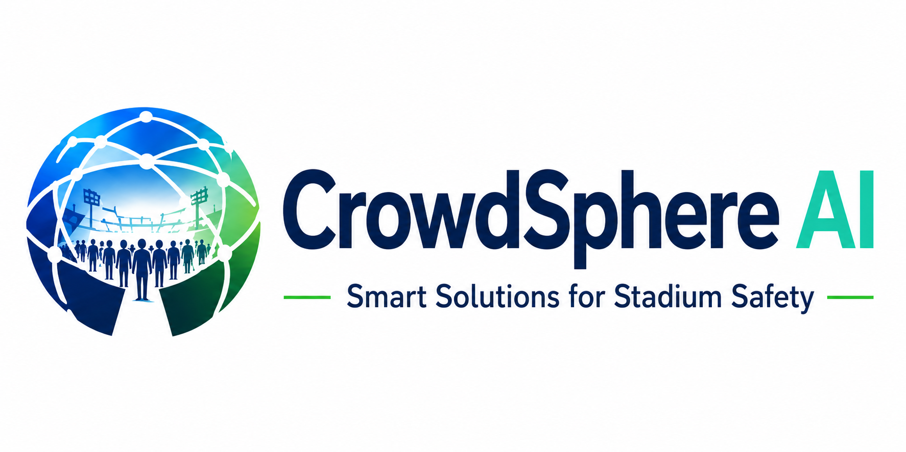

# CrowdSphere AI

**Integrated real-time command platform** for cricket stadium operations at **Rajiv Gandhi International Cricket Stadium, Hyderabad** — unifying ticketing, dynamic crowd-flow routing, AI vision, and automated emergency response.

Built for dangerous bottlenecks and fragmented manual systems during pre-match ingress, in-play congestion, and post-match egress.



---

## What it does

CrowdSphere AI gives stadium operators a single **command center** that:

- Streams **live zone occupancy**, gate queues, and incidents (SSE)
- Runs **Gemini** for crowd telemetry, CCTV-style vision, emergency playbooks, and blueprint egress
- Runs **OpenAI GPT-4o** as a **Command Copilot** with function calling and SOP retrieval
- Applies **routing plans** (`hold` / `in` / `out`) and digital signage to simulated zones
- Supports **match phases**, **IPL fixtures**, and **security tiers** (low / standard / high)
- Speaks **voice alerts** for warnings and recommended actions on live match days

No real CCTV feed is required for the demo — vision can **simulate** analysis from live telemetry.

---

## Problem → solution

| Challenge | CrowdSphere capability |
|-----------|----------------------|
| Dangerous bottlenecks | Live zone map, density status, AI routing |
| Fragmented ticketing | Unified gate scan API tied to zone occupancy |
| Cannot adapt to surges | SSE telemetry + Gemini crowd analysis |
| Weather / emerging threats | Emergency protocols + AI playbooks + shelter webhook |
| Post-match chaos | Match-phase profiles bias egress |
| High-profile IPL fixtures | Per-fixture security posture (stewards, K9, bag checks) |
| Operator overload | Voice alerts + OpenAI copilot with executable tools |

---

## Tech stack

| Layer | Technology |
|-------|------------|
| App | [Next.js 16](https://nextjs.org/) (App Router), React 19, TypeScript, Tailwind CSS v4 |
| Eyes | [@google/genai](https://www.npmjs.com/package/@google/genai) — Gemini 2.5 Flash |
| Brain | [OpenAI](https://platform.openai.com/) — GPT-4o + `text-embedding-3-small` (SOP RAG) |
| Validation | [Zod](https://zod.dev/) |
| Realtime | Server-Sent Events (SSE) + in-memory pub/sub |
| State | In-memory stadium store (`globalThis` singleton) |

---

## Architecture: Eyes + Brain + Hands

```
┌─────────────────────────────────────────────────────────────────┐
│                     Command Center (browser)                     │
│  Zones · Gates · IPL fixtures · Phases · Voice · Copilot chat   │
└────────────────────────────┬────────────────────────────────────┘
                             │ REST + SSE
┌────────────────────────────▼────────────────────────────────────┐
│                      Next.js API routes                            │
│  /api/events  /api/crowd  /api/match  /api/vision/analyze  …      │
└─────┬───────────────────────────────┬───────────────────────────┘
      │                               │
      ▼                               ▼
┌─────────────┐                 ┌─────────────┐
│   Gemini    │                 │  OpenAI     │
│  (vision,   │                 │  (copilot,  │
│  telemetry, │                 │   tools,    │
│  playbooks) │                 │   SOP RAG)  │
└─────────────┘                 └─────────────┘
      │                               │
      └───────────────┬───────────────┘
                      ▼
              ┌───────────────┐
              │ Stadium store  │
              │ zones · gates  │
              │ incidents      │
              └───────────────┘
```

| Role | Provider | Examples |
|------|----------|----------|
| **Eyes** | Gemini | Telemetry advisor, vision (upload or **demo scan**), emergency playbooks, blueprint egress |
| **Brain** | OpenAI | Natural-language copilot, SOP-aware answers, tool execution |
| **Hands** | Backend | `apply_crowd_routing`, shelter protocol, signage, emergencies |

**Vision → Copilot pipeline:** `/api/vision/analyze` → vision alert → `/api/pipeline/vision-to-copilot` → operator chat with tools.

---

## Quick start

### Prerequisites

- **Node.js** 20+
- npm

### Install and run

```bash
git clone <your-repo-url>
cd Google_Ananta
npm install
cp .env.example .env.local
```

Edit `.env.local` and add API keys (optional but recommended):

```env
GEMINI_API_KEY=your_key_from_https://aistudio.google.com/apikey
OPENAI_API_KEY=your_key_from_https://platform.openai.com/api-keys
```

```bash
npm run dev
```

Open [http://localhost:3000](http://localhost:3000).

### Scripts

| Command | Description |
|---------|-------------|
| `npm run dev` | Development server |
| `npm run build` | Production build |
| `npm run start` | Run production build |
| `npm run lint` | ESLint |
| `npm run typecheck` | TypeScript check |

---

## Environment variables

| Variable | Required | Purpose |
|----------|----------|---------|
| `GEMINI_API_KEY` | No* | Vision, telemetry advisor, emergency playbooks, blueprint guidance |
| `OPENAI_API_KEY` | No* | Command Copilot (GPT-4o + tools) and SOP embeddings |

\*Without keys, the app uses **rule-based fallbacks** so judges and demos still work.

API keys are **server-only** — never exposed to the browser.

---

## Dashboard guide

### Header controls

| Control | Behavior |
|---------|----------|
| **IPL match** | Switch fixtures (grouped by low / standard / **high** security) |
| **Match phase** | Pre-match · In play · Post-match — changes crowd profiles |
| **Voice on/off** | Browser speech for warnings + actions (live match days only) |
| **Connected** | SSE link to live telemetry |
| **Live / Offline** | **Live** when fixture date = today; otherwise historical replay |

Changing match or phase shows a loading overlay and refreshes telemetry + Gemini advisor.

### Main sections

1. **Real-time monitoring** — Occupancy, zones, gates, vision count  
2. **Match & event analytics** — Fixture context and capacity bar  
3. **Security intelligence** — Steward/K9 deployment, fixture security tier  
4. **AI risk prediction** — Composite score from density, vision, emergencies, insights  
5. **Live operations** — Zone map, ticketing, vision, copilot, emergency, Gemini advisor  

Click the **stadium name** in the sub-header for venue history, gates, and security records.

### High-security sell-out crowds

For **SRH vs RCB**, **SRH vs MI**, and **SRH vs GT** (high security), set phase to **In play** to see roughly **98–99%** stadium occupancy and mostly critical/elevated zones.

### Gemini vision (no video required)

1. Open **Gemini vision — density & anomalies**  
2. Pick a **camera / zone**  
3. Click **Simulate CCTV scan (no video needed)**  

Uses live zone telemetry + stadium blueprint. Optional: expand **upload real CCTV frames** if you have images.

### Voice alerts

Enable **Voice on** during a **live** fixture. The browser will announce:

- Critical / elevated zones  
- Emergencies and vision alerts  
- AI advisor risk changes  
- Recommended actions (hold ingress, egress, deploy stewards, etc.)

---

## API reference

| Endpoint | Method | Purpose |
|----------|--------|---------|
| `/api/state` | GET | Full stadium snapshot |
| `/api/events` | GET | SSE stream (state + heartbeat; ~4s simulation tick) |
| `/api/ticketing/scan` | POST | Simulate ticket scan → update gate/zone |
| `/api/crowd` | GET/POST | Zone/gate data; apply routing plan |
| `/api/emergency` | GET/POST/PATCH | Trigger / list / resolve incidents |
| `/api/ai/analyze` | POST | Gemini telemetry crowd analysis |
| `/api/match` | PATCH | `{ phase }` and/or `{ fixtureId }` — updates crowd + advisor |
| `/api/vision/analyze` | POST | Vision: `{ demo: true }` **or** `images[]` (base64) |
| `/api/copilot/chat` | POST | OpenAI copilot + function calling |
| `/api/copilot/draft-comms` | POST | Draft fan communications |
| `/api/pipeline/vision-to-copilot` | POST | Forward vision alert to copilot |
| `/api/webhooks/weather` | POST | Lightning webhook → shelter protocol |
| `/api/blueprint/exit` | POST | Blueprint-aware egress sentence |

### Example: simulate vision (no images)

```bash
curl -X POST http://localhost:3000/api/vision/analyze \
  -H "Content-Type: application/json" \
  -d '{
    "zoneId": "food-court",
    "locationLabel": "Concourse & Food Court",
    "timeWindowMinutes": 5,
    "demo": true
  }'
```

### Example: change match fixture

```bash
curl -X PATCH http://localhost:3000/api/match \
  -H "Content-Type: application/json" \
  -d '{ "fixtureId": "srh-rcb-2026", "phase": "in_play" }'
```

### Example: weather shelter demo

```bash
curl -X POST http://localhost:3000/api/webhooks/weather \
  -H "Content-Type: application/json" \
  -d '{ "distanceMiles": 2.5 }'
```

---

## Project structure

```
src/
├── app/                    # Next.js App Router
│   ├── api/                # REST + SSE endpoints
│   ├── globals.css
│   └── page.tsx            # Command center entry
├── components/
│   ├── CommandCenter.tsx   # Main dashboard shell
│   ├── VisionPanel.tsx     # Vision demo + optional upload
│   ├── CopilotPanel.tsx    # OpenAI chat
│   ├── EmergencyPanel.tsx
│   ├── AIAdvisor.tsx       # Gemini telemetry advisor
│   └── dashboard/          # Header, widgets, analytics, modals
├── data/
│   ├── stadium-profile.json
│   ├── stadium-blueprint.json
│   └── emergency-sops.json
├── hooks/
│   ├── useStadiumStream.ts # SSE + state normalization
│   └── useVoiceAlerts.ts   # Browser speech alerts
└── lib/
    ├── gemini.ts           # Telemetry + playbooks
    ├── gemini-vision.ts    # CCTV + demo telemetry vision
    ├── openai-copilot.ts   # GPT-4o copilot
    ├── ipl-fixtures.ts     # IPL matches + security tiers
    ├── match-phase-profiles.ts
    ├── match-broadcast.ts  # Live vs offline by date
    ├── store.ts            # In-memory stadium state
    └── broadcast.ts        # SSE pub/sub
```

---

## Google AI SDK (`@google/genai`)

Implementation: `src/lib/gemini.ts`, `src/lib/gemini-vision.ts`

- Server-side `GoogleGenAI` client with `GEMINI_API_KEY`
- `generateContent` with `responseMimeType: application/json` for structured insights
- Multimodal vision when images are uploaded; text-only **demo** mode when they are not
- Rules-based fallbacks when the key is missing or the API errors

---

## Scalability and security (design notes)

**Scalability (production path)**

- Replace in-memory store with Redis or Postgres  
- Replace in-process `broadcast.ts` with Redis Pub/Sub, Ably, or similar  
- Move simulation ticks to a background worker  
- Horizontally scale stateless Next.js instances behind a load balancer  

**Security (current demo)**

- API keys stay on the server  
- Zod validation on request bodies  
- Input sanitization (`sanitizeText`)  
- Per-IP rate limiting on API routes (stricter on AI endpoints)  

---

## Suggested demo flow (5–10 minutes)

1. Open dashboard — note **Live** badge if today matches fixture date (default: SRH vs RCB).  
2. Select a **high-security** match → **In play** — occupancy ~98%+.  
3. Turn **Voice on** — hear alerts when zones go critical.  
4. **Simulate ticket scan** at a busy gate.  
5. **Simulate CCTV scan** on Food Court — review density and blueprint guidance.  
6. **Run Gemini Crowd Analysis** → **Apply AI Routing Plan**.  
7. **Trigger emergency** (e.g. crowd crush) — review AI playbook → **Resolve**.  
8. Open **Command Copilot** — ask “What should we do about North Stand?” and approve tool actions.  
9. Switch to **Post-match** — observe egress bias.  
10. `POST /api/webhooks/weather` — shelter protocol closes open-air zones.

---

## CI

GitHub Actions (`.github/workflows/ci.yml`) runs `lint`, `typecheck`, and `build` on push/PR.

---

## Deploy to Google Cloud (Cloud Run)

**Project:** `crowdsphereai` — open [Cloud Shell](https://console.cloud.google.com/welcome?project=crowdsphereai&cloudshell=true) for that project.

1. **Enable billing** on the project ([Billing](https://console.cloud.google.com/billing/linkedaccount?project=crowdsphereai)) — required for Cloud Run and Cloud Build.
2. In Cloud Shell:

```bash
git clone https://github.com/keshavatigro/CrowdSphereAI.git
cd CrowdSphereAI
export GEMINI_API_KEY="your-gemini-key"
export OPENAI_API_KEY="your-openai-key"
chmod +x scripts/deploy-cloud-run.sh
./scripts/deploy-cloud-run.sh
```

The script enables APIs, stores keys in **Secret Manager**, builds the Docker image from the repo `Dockerfile`, and deploys **`crowdsphere-ai`** to **Cloud Run** (`us-central1`). When it finishes, it prints the public HTTPS URL.

To redeploy after code changes: `git pull` in the repo folder, then run the script again.

---

## License

MIT
